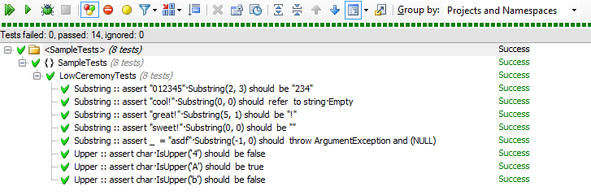

# FluenTest

## Low-ceremony tests and fluent assertions

As clean coders, we put a high value on cleanliness in code, especially unit test code.  Because, after all, if a test is not readable, it is not maintainable, and if it is not maintainable, it's worse than no tests at all.

The Nemerle programming language is a particularly clean, readable, and extensible syntax, making it easy to write self-documenting tests that are easy to read, understand, and maintain.

### Test any .net code with tests written in Nemerle with FluenTest

Nemerle is a .net language, and as such it can target any .net assembly.  Write your library in C#, F#, clojure.net, VB.net, Nemerle.  Then, write your tests in Nemerle and FluenTest.

### Fluent Assertions (Syntax extensions in Nemerle)

Fluent assertions are easy to read.  Check these out:

```nemerle

assert char.IsUpper('A') should be true
// In C#:
// Assert.IsTrue(char.IsUpper('A'));

assert "sweet!".Substring(0, 0) should be ""
// In C#:
// Assert.AreEqual("", "sweet!".Substring(0, 0));

assert "cool!".Substring(0, 0) should refer to string.Empty
// In C#:
// Assert.IsTrue(ReferenceEquals(string.Empty, "cool!".Substring(0, 0)));

assert 5 should match IsOdd
// In C#:
// Assert.IsTrue(IsOdd(5));

assert _ = "throw".Substring(-1,0) should throw ArgumentException
// In C# (roughly equivalent):
// bool exceptionThrown = false;
// try
// {
//    "throw".Substring(-1,0);
// }
// catch(ArgumentException)
// {
//    exceptionThrown = true;
// }
// if(!exceptionThrown)
//    Assert.Fail("Expected ArgumentException, but no exception was thrown.");
```

### Low-ceremony: Single-line tests

Unit tests that describe a behavior should just test one behavior at a time.  A behavior can be described in a single sentence, so why not a single line of code?  

```nemerle

#pragma indent

using System
using Microsoft.VisualStudio.TestTools.UnitTesting
using FluenTest

namespace SampleTests
  [TestClass]\
  public class LowCeremonyTests
    [OneLiner] Substring() : void
      assert "sweet!".Substring(0,0) should be ""
      assert "great!".Substring(5,1) should be "!"
      assert "012345".Substring(2,3) should be "234"
      assert "cool!".Substring(0,0) should refer to string.Empty
      assert _ = "asdf".Substring(-1,0) should throw ArgumentException

    [OneLiner] Upper() : void
      assert char.IsUpper('A') should be true
      assert char.IsUpper('b') should be false
      assert char.IsUpper('4') should be false

```

The sample above defines 5 Substring tests and 3 Upper tests.  In standard MSTest style, the above would be two tests, not 8.  With the `[OneLiner]` macro, 8 tests are defined as seen below.  And they have clear names - No more restating test code in english just to give the test a memorable name.



### Low-ceremony: No need to define a test twice (english and nemerle)

Said another way, in the Nemerle code, 1 class is defined with **2 methods**.  The compiled output is 1 class with **8 methods**.  The generated methods have such amazing names as `Substring :: assert "cool!"·Substring(5, 1) should be "!"`.  (Yes, that method name has spaces and funky characters that you probably never thought you would see in a method name).

This quite literal method name means you can focus on writing a clear test without having to come up with an english description for each test.  The differences between tests are clear because the test code is in the name.

When a test consists of a single line of code, in C# this would probably require 3-5 lines of code.  So each one-line test would take up 5 lines of code.

#### Low-ceremony: Less code, less cruft, less redundancy

```cs
/* 1 */ [TestMethod]
/* 2 */ public void ZeroDotAdd1ShouldBe1()
/* 3 */ {
/* 4 */    Assert.AreEqual(1, 0.Add(1));
/* 5 */ }

/* 1 */ [TestMethod]
/* 2 */ public void ZeroDotAdd1DotAdd2ShouldBe1()
/* 3 */ {
/* 4 */    Assert.AreEqual(3, 0.Add(1).Add(2));
/* 5 */ }
```

Did you notice my copy and paste error (1+2 = 3, but the method is named "...ShouldBe1")?  Code written this way violates the single truth rule.

Now consider to the following Nemerle FluenTest code.  The equivilant code which is grouped nicely.  The code expresses in 3-4 lines what took 10 to do above.

```nemerle
[OneLiner]\
Add() : void
  Assert.AreEqual(1, 0.Add(1));
  Assert.AreEqual(3, 0.Add(1).Add(2));
```

Writing tests in this concise way lets you express and describe the behavior in code.

# Behavior Driven Development Sample

This sample illustrates a way of making concise BDD-style tests.  The following code defines 12 tests in `MathBddTest` which is the base class for classes `WhenBaseNumberIs0`, `WhenBaseNumberIs1`, etc.  So, 48 tests are defined in all (in ~46 lines of code).

```nemerle
#pragma indent

using System
using Microsoft.VisualStudio.TestTools.UnitTesting
using FluenTest

namespace SampleTests
  [Record]\
  public abstract class MathBddTest
    protected BaseNumber : int

    [OneLiner] Add() : void
      assert BaseNumber.Add(0) should be BaseNumber
      assert BaseNumber.Add(2) should be BaseNumber + 2
      assert BaseNumber.Add(-3) should be BaseNumber - 3

    [OneLiner] Subtract() : void
      assert BaseNumber.Subtract(0) should be BaseNumber
      assert BaseNumber.Subtract(2) should be BaseNumber - 2
      assert BaseNumber.Subtract(-3) should be BaseNumber + 3

    [OneLiner] Multiply() : void
      assert BaseNumber.Multiply(0) should be 0
      assert BaseNumber.Multiply(2) should be BaseNumber * 2
      assert BaseNumber.Multiply(-3) should be BaseNumber * -3

    [OneLiner] DivideBy() : void
      assert _ = BaseNumber.DivideBy(0) should throw DivideByZeroException
      assert BaseNumber.DivideBy(2) should be BaseNumber / 2
      assert BaseNumber.DivideBy(-3) should be BaseNumber / -3

    [TestClass] public class WhenNumberIs0 : MathBddTest
      public this()
        base(0)

    [TestClass] public class WhenNumberIs1 : MathBddTest
      public this()
        base(1)

    [TestClass] public class WhenNumberIs2 : MathBddTest
      public this()
        base(2)

    [TestClass] public class WhenNumberIs60 : MathBddTest
      public this()
        base(60)
```

## Happy testing

Feel free to contact me, add issues, or suggest improvements.